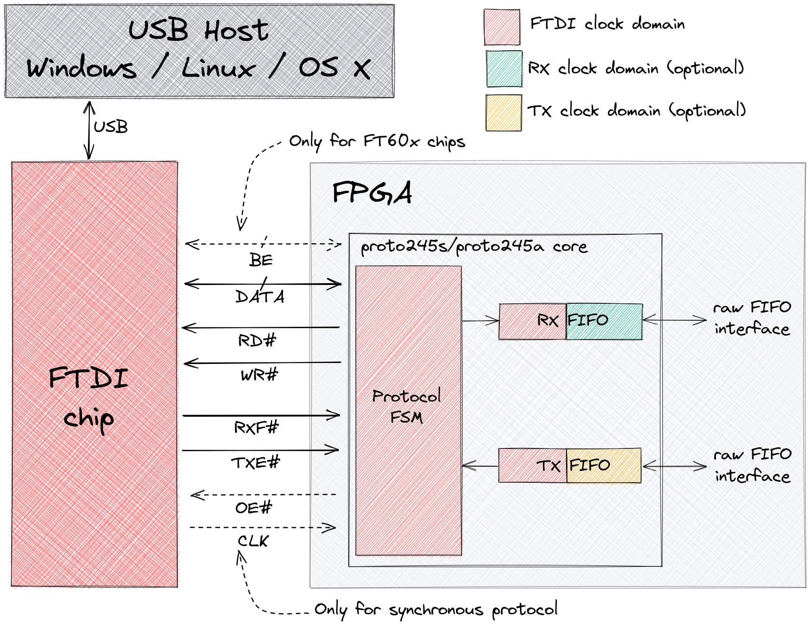
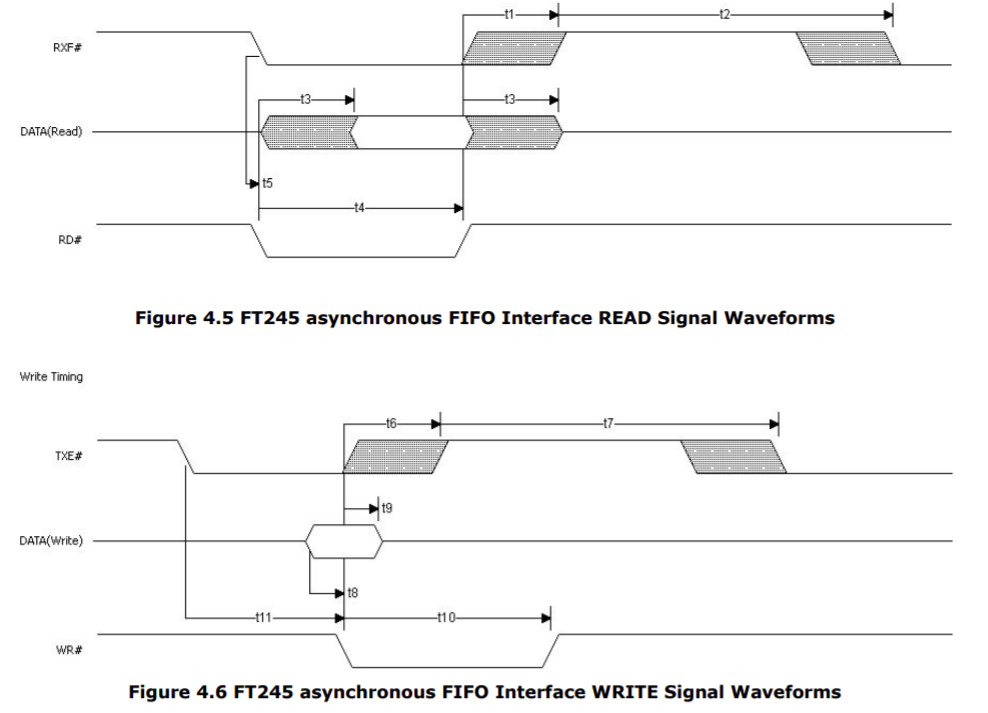
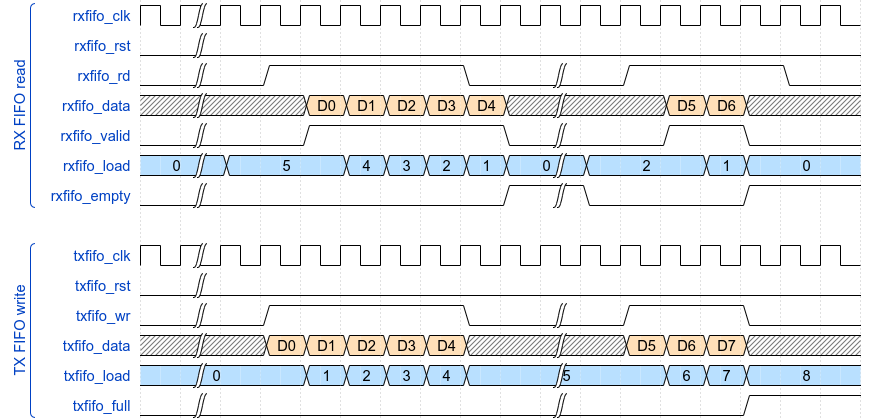
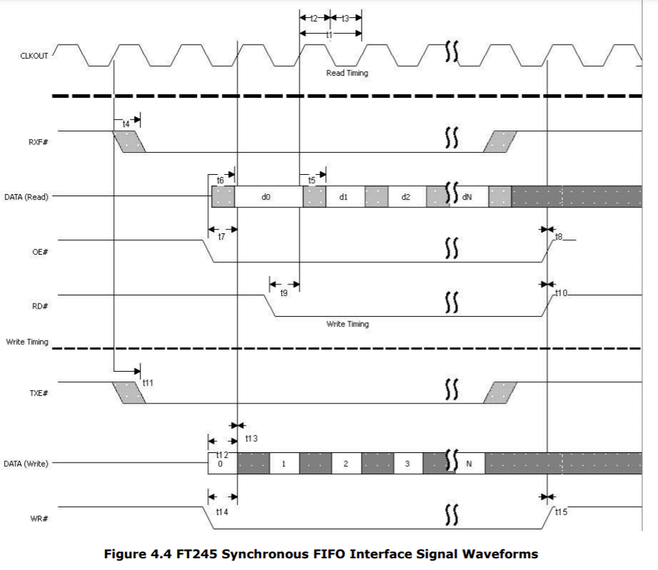
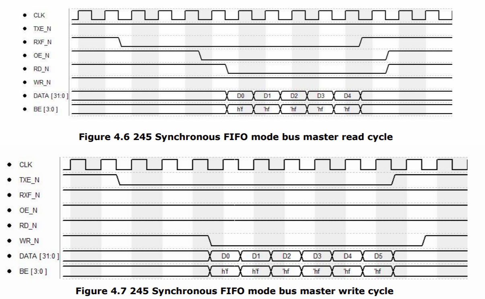

# Synchronous/Asynchronous FT245 FIFO protocol cores



IP-cores written in SystemVerilog for communicating with numerous FTDI chips using FT245 FIFO protocol.

The protocol exists in the two versions: synchronous and asynchronous, and there are two cores ```proto245s``` and ```proto245a``` to use with the appropriate version.
Table with supported FTDI devices (based on the protocol specifications) below.

| FTDI Chip                                                                                               | USB Speed  | Asynchronous FIFO | Synchronous FIFO |
| :------------------------------------------------------------------------------------------------------ | :--------- | :---------------- | :--------------- |
| [FT245R](https://ftdichip.com/products/ft245rq/)                                                        | FullSpeed  | ↔️ 1MB/s           | ❌                |
| [FT240X](https://ftdichip.com/products/ft240xs/)                                                        | FullSpeed  | ↔️ 1MB/s           | ❌                |
| [FT2232D](https://ftdichip.com/products/ft2232d/)                                                       | FullSpeed  | ↔️ 1MB/s           | ❌                |
| [FT232H](https://ftdichip.com/products/ft232hq/)                                                        | HighSpeed  | ↔️ 8MB/s           | ↔️ 40MB/s         |
| [FT2232H](https://ftdichip.com/products/ft2232hq/)                                                      | HighSpeed  | ↔️ 8MB/s           | ↔️ 40MB/s         |
| [FT232HP](https://ftdichip.com/products/ft232hp/)/[FT233HP](https://ftdichip.com/products/ft233hp/)     | HighSpeed  | ↔️ 8MB/s           | ↔️ 40MB/s         |
| [FT2232HP](https://ftdichip.com/products/ft2232hp/)/[FT2233HP](https://ftdichip.com/products/ft2233hp/) | HighSpeed  | ↔️ 8MB/s           | ↔️ 40MB/s         |
| [FT600Q](https://ftdichip.com/products/ft600q-b/)                                                       | SuperSpeed | ❌                 | ↔️ 200MB/s        |
| [FT601Q](https://ftdichip.com/products/ft601q-b/)                                                       | SuperSpeed | ❌                 | ↔️ 400MB/s        |
| [FT602Q](https://ftdichip.com/products/ft602q-b/)                                                       | SuperSpeed | ❌                 | ↔️ 400MB/s        |

## proto245a core

Implements asynchronous FT245 protocol from the one side and provides RX & TX FIFO interfaces from the other side.

Features:

- configurable RX & TX FIFO size
- configurable ```RD#``` & ```WR#``` assertion time to adapt to any clock frequency
- flexible clock domains - FSM and FIFOs might share the same clock or use separate clocks

Notes:

- Send Immediate / Wake Up signal (SIWU) tied to inactive state

### Core hierarchy

Single clock domain:

```
proto245a (proto245a.sv)
├── rxfifo (fifo_sync.sv)
│   └── dpram (dpram.sv)
└── txfifo (fifo_sync.sv)
    └── dpram (dpram.sv)
```

Multiple clock domains:
```
proto245a (proto245a.sv)
├── rxfifo (fifo_async.sv)
│   └── dpram (dpram.sv)
└── txfifo (fifo_async.sv)
    └── dpram (dpram.sv)
```

### FTDI side access waveforms

From FT2232H [datasheet](http://www.ftdichip.com/Support/Documents/DataSheets/ICs/DS_FT2232H.pdf).



### FIFOs side access



## proto245s core

Implements synchronous FT245 protocol from the one side and provides RX & TX FIFO interfaces from the other side.

Features:

- configurable data size (e.g. 8 bits needed for HS devices, 16/32 bits for SS devices)
- configurable RX & TX FIFO size
- configurable RX & TX burst size - maximum number of words per one read/write burst (optional)
- configurable RX & TX FIFO thresholds - transaction will start only if FIFO is filled below/above the threshold
- configurable pause between transactions
- flexible clock domains - FSM and FIFOs might share the same clock or use separate clocks

Notes:

- FT2xx chips: Send Immediate / Wake Up signal (SIWU) tied to inactive state
- FT60x chips: Byte Enable signals (BE) are not supported at the moment, so, all transactions have to be word aligned

### Core hierarchy

Single clock domain:

```
proto245s (proto245s.sv)
├── rxfifo (fifo_sync.sv)
│   └── dpram (dpram.sv)
├── txfifo (fifo_sync.sv)
│   └── dpram (dpram.sv)
└── txovrbuf (fifo_sync.sv)
    └── dpram (dpram.sv)
```

Multiple clock domains:
```
proto245s (proto245s.sv)
├── rxfifo (fifo_async.sv)
│   └── dpram (dpram.sv)
├── txfifo (fifo_async.sv)
│   └── dpram (dpram.sv)
└── txovrbuf (fifo_sync.sv)
    └── dpram (dpram.sv)
```

### FTDI side access waveforms

From FT2232H [datasheet](http://www.ftdichip.com/Support/Documents/DataSheets/ICs/DS_FT2232H.pdf).



From FT600Q/FT601Q [datasheet](https://ftdichip.com/wp-content/uploads/2020/07/DS_FT600Q-FT601Q-IC-Datasheet.pdf).



### FIFOs side access

The same as for ```proto245a``` core.

## Examples

| Project                                       | FPGA/Board                                                                               | FTDI chip                                          | Software                                            |
| :-------------------------------------------- | :--------------------------------------------------------------------------------------- | :------------------------------------------------- | :-------------------------------------------------- |
| [ft2232h_de10lite](examples/ft2232h_de10lite) | [DE10-Lite](https://www.terasic.com.tw/cgi-bin/page/archive.pl?Language=English&No=1021) | [FT2232H](https://ftdichip.com/products/ft2232hq/) | Python ([ftd2xx](https://pypi.org/project/ftd2xx/)) |

For more details please follow README files inside ```examples/$PROJNAME$``` directories.

## Simulation and testing

Environment is built around Python [pytest](https://docs.pytest.org/) framework - it offers some nice and easy to use tools for test execution control and parametrization out of the box.

Current workflow is based on the [pyhdlsim](https://github.com/esynr3z/pyhdlsim) example - ```sim.py``` is a wrapper around HDL simulators and ```test_*.py``` files contain tests.

Tested on:

* Windows 10, Python 3.8, Modelsim 10.6d
* Ubuntu 20.04, Python 3.8, Modelsim 2020.02

For more details please follow testing [README](tests/README.md).
