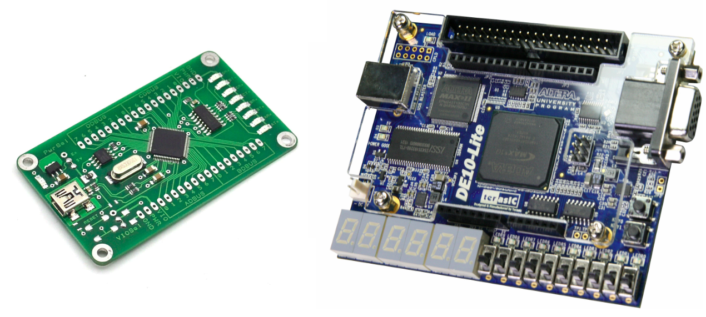

# FT2232H + DE10-Lite example



## Hardware

### Compilation

Quartus 19.1.0 Lite is used.

Simply run ```./create_proj.sh``` to create the Quartus project from the tcl file.

### Syncronous vs Asynchronous FT245

By default, synchronous mode is enabled. To switch to asynchronous just comment the define ```FIFO245_SYNC```
in ```top.sv``` file.

```
//------------------------------------------------------------------------------
// FT245 protocol master
//------------------------------------------------------------------------------
//`define FIFO245_SYNC

`ifdef FIFO245_SYNC
    `include "sync245.svh"
`else
    `include "async245.svh"
`endif
```

### Connections

All the connections are below.

| FT Pin | FT Function | GPIO J1 Header | RTL Top    |
| :----- | :---------- | :------------- | :--------- |
| ADBUS0 | D0          | gpio[8]        | ft_data[0] |
| ADBUS1 | D1          | gpio[10]       | ft_data[1] |
| ADBUS2 | D2          | gpio[12]       | ft_data[2] |
| ADBUS3 | D3          | gpio[14]       | ft_data[3] |
| ADBUS4 | D4          | gpio[16]       | ft_data[4] |
| ADBUS5 | D5          | gpio[18]       | ft_data[5] |
| ADBUS6 | D6          | gpio[20]       | ft_data[6] |
| ADBUS7 | D7          | gpio[22]       | ft_data[7] |
| ACBUS0 | RXF#        | gpio[24]       | ft_rxfn    |
| ACBUS1 | TXE#        | gpio[26]       | ft_txen    |
| ACBUS2 | RD#         | gpio[28]       | ft_rdn     |
| ACBUS3 | WR#         | gpio[30]       | ft_wrn     |
| ACBUS4 | SIWU        | gpio[32]       | ft_siwu    |
| ACBUS5 | CLKOUT      | gpio[2]        | ft_clk     |
| ACBUS6 | OE#         | gpio[34]       | ft_oen     |

## Software

System:

* Ubuntu 20.04
* Python 3.7

All tests evaluate read and write throughtput.

### test_ftd2xx.py

Requirements:

* [D2xx Driver](https://ftdichip.com/drivers/d2xx-drivers/)
* [ftd2xx](https://github.com/snmishra/ftd2xx)

Results (synchronous 245):

```
$ ./test_ftd2xx.py
Read 100.00 MiB (104857600 bytes) from FPGA in 10.846953 seconds (9.22 MiB/s)
Verify data: ok
Wrote 100.00 MiB (104857600 bytes) to FPGA in 2.632750 seconds (37.98 MiB/s)
Verify data: ok
```

*Note* - known [issue](https://github.com/0x6a77/JD2XX/issues/9) with sync fifo speed under linux.

### test_pylibftdi.py

Requirements:

* [pylibftdi](https://github.com/codedstructure/pylibftdi)
* [libftdi](https://www.intra2net.com/en/developer/libftdi/index.php)

Results (synchronous 245):

```
$ ./test_pylibftdi.py
Read 100.00 MiB (104857600 bytes) from FPGA in 2.705440 seconds (36.96 MiB/s)
Verify data: ok
Wrote 100.00 MiB (104857600 bytes) to FPGA in 2.717165 seconds (36.80 MiB/s)
Verify data: ok
```

### test_ftdi1.py

Requirements:

* [pylibftdi](https://github.com/codedstructure/pylibftdi)
* ftdi1 - SWIG wrapper (check ```python``` folder in ```libftdi``` sources root)

Results (synchronous 245):

```
$ ./test_ftdi1.py
Read 100.00 MiB (104857600 bytes) from FPGA in 2.422061 seconds (41.29 MiB/s)
Verify data: ok
Wrote 100.00 MiB (104857600 bytes) to FPGA in 2.342588 seconds (42.69 MiB/s)
Verify data: ok
```

### test_pyusb.py

Requirements:

* [pyusb](https://github.com/pyusb/pyusb)

Results (synchronous 245):

```
$ ./test_ftdi1.py
Read 100.00 MiB (104857600 bytes) from FPGA in 2.422061 seconds (41.29 MiB/s)
Verify data: ok
Wrote 100.00 MiB (104857600 bytes) to FPGA in 2.342588 seconds (42.69 MiB/s)
Verify data: ok
```
